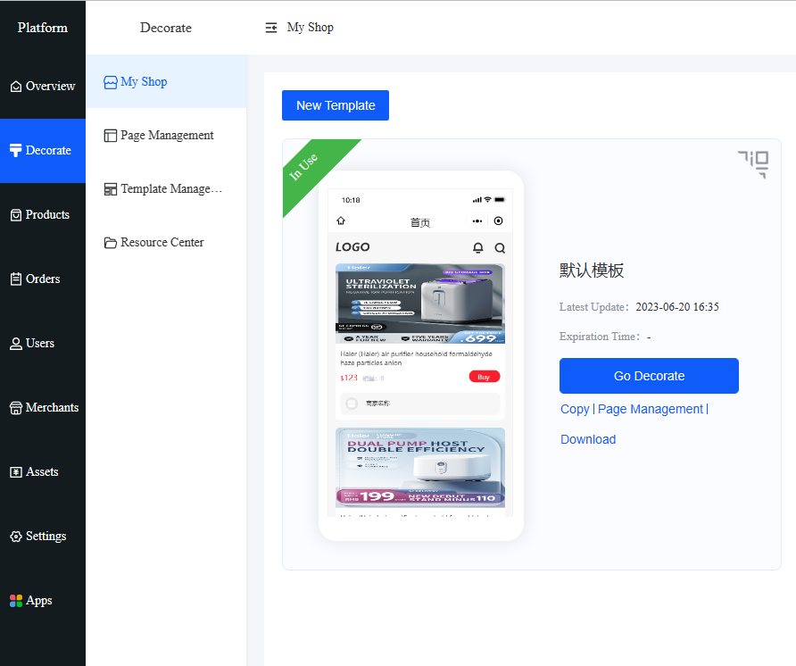
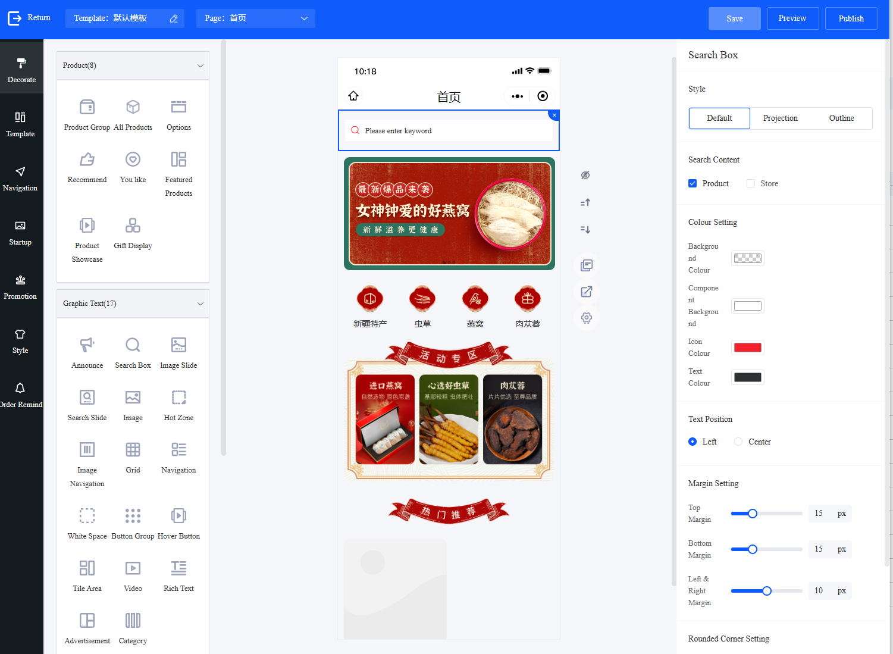
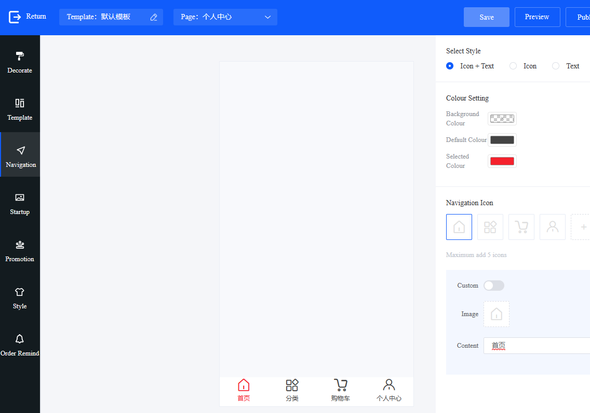

# Section 1: SaaS Platform Decoration User Manual

1. Use the decoration page.

- You can choose a suitable template in "My Store," change the pictures, and redo the links. (Decoration-My Store-New Template-Choose a suitable template-Create-Save)

- Shop homepage, member center, product details. (Decoration-New Template-Choose the name of our template above-Choose the page we want to decorate-Choose the publishing channel: APP, mini program, public account)

Note: Public account pages and mini program pages are decorated separately, while personal center and product details can be decorated together or separately.

2. (On the left is the decorated commodity component, graphic component, basic component, and other components that can be clicked to the prototype page in the middle).

- The basic component-Store component is the module of the page.

- Marketing plugins need to be accompanied by the creation of marketing activities.

3. After clicking on the component to the prototype page in the middle, you can click on the right to edit and set it up.

- (The principle of decoration-select the framework component-upload the corresponding size picture that has been designed-adjust the link on the corresponding picture).

- At the same time, you can create other pages to design and decorate secondary pages.

4. Create a bottom navigation.

- (Decorate-Navigation bar-Decorate the navigation bar content needed-Select the publishing channel: APP, mini program, public account-Save)

- Style selection requires the desired color template (select the color you like, and click to use it directly).

- Order reminder (add a member-select the order time-display the member XX seconds before placing the order on our mobile end).